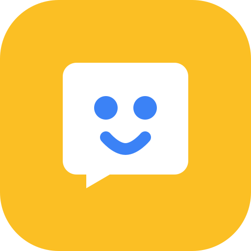

<div align="center">



# My Voice Board

**Giving a voice to everyone — personalized picture communication boards (AAC) for non-verbal children and adults.**

[](https://www.myvoiceboard.com/)
[](https://www.myvoiceboard.com/about)
[](https://nextjs.org/)
[](https://react.dev/)
[](https://www.typescriptlang.org/)
[](https://www.myvoiceboard.com/)

**[Explore the Live App: https://www.myvoiceboard.com/](https://www.myvoiceboard.com/)**

---

</div>

## 💡 About My Voice Board

> *"Everyone deserves to be heard. Communication tools should be accessible, personal, and easy to use."*

**[My Voice Board](https://www.myvoiceboard.com/)** turns custom photos and familiar voices into interactive picture communication boards (AAC - Augmentative and Alternative Communication). Tap a card — it speaks!

### Why We Built This

As a parent of two non-verbal children, the creator of My Voice Board experienced firsthand how challenging, overwhelming, and expensive AAC communication tools can be. Many existing tools cost hundreds of dollars, lock essential features behind monthly paywalls, or rely on generic synthetic voices and abstract symbols that non-verbal individuals may struggle to connect with.

My Voice Board was built to solve this: a tool designed with love for families, carers, teachers, and speech therapists, making personalized communication accessible to everyone without cost barriers.

---

## 💖 100% Non-Commercial & Ad-Free

My Voice Board is strictly a **non-commercial, mission-driven project**:

- **100% Free**: No subscriptions, no fees, no in-app purchases, and no locked features.
- **Zero Advertising**: Communication is essential, not an advertising space. The app is completely ad-free and will always remain so.
- **Your Data Remains Yours**: Built to help people communicate, never to harvest or sell data. Custom photos, personal voice recordings, and boards remain strictly private to you unless you explicitly choose to publish a board to the community library.

---

## ✨ Key Features

- 🖼️ **Personalized Communication Boards**  
  Create unlimited boards tailored for routines, environments, or specific activities (e.g., morning routines, meals, school, sensory activities, or outings).

- 📸 **Real Photos, Symbols & AI Generation**  
  Upload photos of familiar people, favourite toys, and familiar objects, select from symbol sets, or generate contextual images with AI when a photo isn't handy.

- 🎙️ **Familiar Voices & High-Quality Speech**  
  Record audio directly in the browser with familiar voices (parents, siblings, carers) or utilize clear text-to-speech audio.

- 🗣️ **Sentence Builder**  
  Tap cards sequentially to build and speak complete multi-word sentences and requests.

- 🔒 **Locked "Use Mode" (Child / Kiosk Mode)**  
  Carers can lock a board into fullscreen use mode with a hold-to-unlock carer quiz, preventing accidental navigation, browser back buttons, or editing during active communication.

- 📱 **Progressive Web App (PWA) & Offline Support**  
  Installable on tablets, phones, and computers. Fully cached for offline use, including iOS-compatible byte-range audio playback so boards work seamlessly on airplanes, in cars, or without an internet connection.

- 🌍 **Public Board Library & Community Sharing**  
  Browse pre-built templates created by other parents and educators or share your own boards to support others.

---

## 🛠️ How It Works

```
┌─────────────────┐      ┌─────────────────┐      ┌─────────────────┐      ┌─────────────────┐
│ 1. Create Board │ ───► │  2. Add Cards   │ ───► │  3. Add Voice   │ ───► │ 4. Communicate  │
│ Routine / place │      │  Photos or AI   │      │ Record or TTS   │      │ Tap card/speak  │
└─────────────────┘      └─────────────────┘      └─────────────────┘      └─────────────────┘
```

1. **Create a Board**: Start a board for a specific daily routine, classroom activity, or location.
2. **Add Cards**: Upload familiar photos, choose symbols, or generate images.
3. **Add Voice**: Record personal audio clips or use text-to-speech.
4. **Communicate**: Use on any device — non-verbal children and adults tap cards to speak!

---

## 💻 Tech Stack

- **Framework**: [Next.js](https://nextjs.org/) (App Router)
- **Frontend**: [React 19](https://react.dev/), [TypeScript](https://www.typescriptlang.org/)
- **Styling**: [Tailwind CSS v4](https://tailwindcss.com/)
- **Authentication**: [Clerk](https://clerk.com/)
- **Database**: [PostgreSQL (Vercel Postgres)](https://vercel.com/docs/storage/vercel-postgres) with versioned SQL migrations
- **File Storage**: [Vercel Blob](https://vercel.com/docs/storage/vercel-blob)
- **Audio & AI**: Google Generative AI & Google Cloud Text-to-Speech
- **Testing**: [Playwright](https://playwright.dev/) end-to-end testing suite

---

## 🚀 Getting Started (Local Development)

### Prerequisites

- [Node.js](https://nodejs.org/) (v20+ recommended)
- `npm`

### 1. Clone the repository & install dependencies

```bash
git clone https://github.com/croftr/pic-speak.git
cd pic-speak
npm install
```

### 2. Configure Environment Variables

Create a `.env.local` file in the root directory:

```env
# Database
POSTGRES_URL="postgres://..."

# Storage
BLOB_READ_WRITE_TOKEN="vercel_blob_..."

# Clerk Authentication
NEXT_PUBLIC_CLERK_PUBLISHABLE_KEY="pk_..."
CLERK_SECRET_KEY="sk_..."

# AI & Voice (Optional / Feature-dependent)
GOOGLE_AI_API_KEY="..."

# Email Notifications (Optional)
RESEND_API_KEY="..."
RESEND_FROM_EMAIL="..."
```

### 3. Run Database Migrations

Apply database schema migrations:

```bash
npm run db:migrate
```

To inspect migration status:

```bash
npm run db:migrate:status
```

### 4. Start Development Server

```bash
npm run dev
```

Open [http://localhost:3000](http://localhost:3000) in your browser to view the application.

---

## 🧪 Testing

The repository includes comprehensive end-to-end and offline test suites:

```bash
# Run Playwright end-to-end tests
npm run test:e2e

# Run all test checks (E2E, build, offline service worker, lock mode, sentence builder)
npm run test:all

# Individual test scripts (requires production build first: npm run build)
npm run test:offline      # Verifies offline service worker & cached audio
npm run test:lock-mode     # Verifies kiosk lock mode and quiz dialog
npm run test:sentence      # Verifies sentence strip construction & playback
```

---

## 🤝 Community & Support

- **Live Application**: [https://www.myvoiceboard.com/](https://www.myvoiceboard.com/)
- **About the Project**: [https://www.myvoiceboard.com/about](https://www.myvoiceboard.com/about)
- **Public Communication Boards**: [https://www.myvoiceboard.com/public-boards](https://www.myvoiceboard.com/public-boards)

Feedback, feature suggestions, and contributions that help non-verbal individuals communicate more freely are warmly welcomed!
